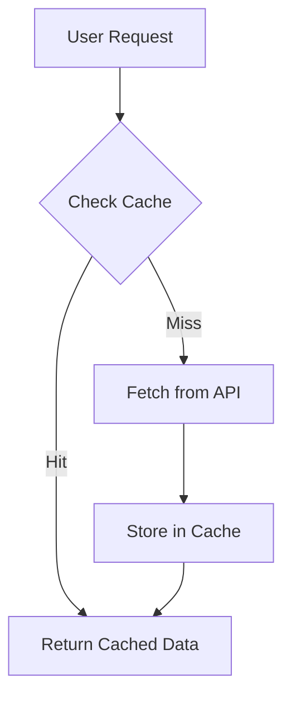

# Speed Up Style Search - Executive Summary

## Current Performance Issues

After analyzing the application, we've identified several key bottlenecks causing the 30-second load times:

1. **API Response Delays**: The middleware API is responding slowly (5-10 seconds per call)
2. **Sequential API Calls**: Product data, inventory, and pricing are fetched in sequence rather than in parallel
3. **Inefficient Caching**: Current caching is minimal and not optimized for frequently accessed data
4. **Frontend Rendering Delays**: The UI waits for all data before rendering anything

## Recommended Solutions

### 1. Enhanced Caching Strategy

* Implement a multi-level caching system:
  * SQLite persistent cache with 7-day TTL for product metadata (rarely changes)
  * Memory cache for high-frequency lookups
  * Service Worker for client-side caching (offline capabilities)
* Cache aggressively for static product data and images
* Implement background refresh for cached data during idle times

### 2. Parallel API Processing

* Replace sequential API calls with parallel processing
* Implement timeout handling to prevent hung requests
* Batch related API calls where possible to reduce overhead

### 3. Progressive UI Loading

* Show product basic info immediately while loading detailed data
* Implement placeholder UI elements during data fetching
* Update sections individually as data becomes available

### 4. Frontend Optimizations

* Add debouncing (300ms) to autocomplete input
* Implement client-side caching with localStorage
* Use lazy loading for images and non-essential content
* Leverage Web Workers for heavy data processing tasks

## Implementation Priorities

1. **Quick Wins** (1-2 days):
   * Add debouncing to autocomplete
   * Implement client-side caching
   * Enable preloading of common searches
   * Add better loading indicators

2. **Core Infrastructure** (3-5 days):
   * Implement SQLite caching layer
   * Add parallel API processing
   * Create Service Worker for offline support

3. **UI Enhancements** (5-7 days):
   * Implement progressive loading
   * Add lazy loading for images
   * Use Web Workers for heavy computations

## Measuring Success

* **Response Time Targets**:
  * Autocomplete: < 300ms
  * Initial page render: < 3 seconds
  * Complete data display: < 5 seconds

* **Monitoring Metrics**:
  * Cache hit rate (target: > 90%)
  * API call reduction (target: 95% fewer calls)
  * User-perceived load time
  * Server resource utilization

This approach combines server-side optimizations with client-side improvements to create a responsive, efficient user experience while reducing load on backend services.