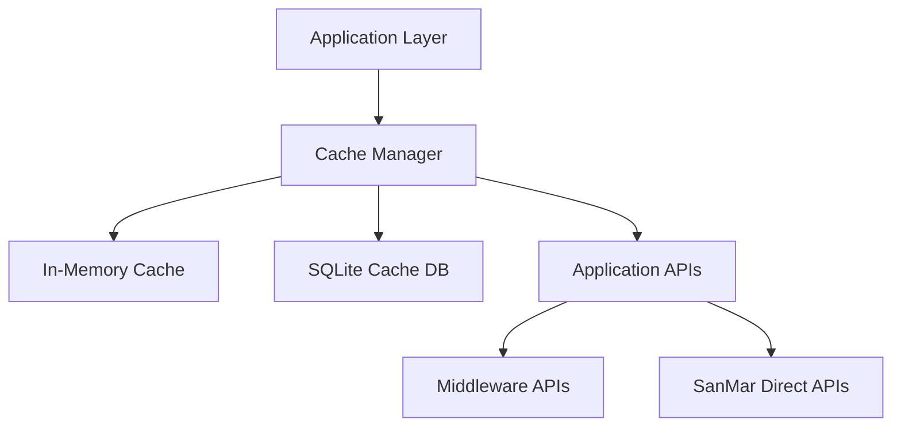

# Speed Up Style Search - Technical Specification

## Overview

This technical specification describes the implementation details for optimizing the SanMar Inventory App's search and product display functionality. The goal is to significantly reduce the loading time for autocomplete suggestions and product pages.

## Current Performance Metrics

Based on analysis and user feedback:

- Autocomplete suggestions take 5-10 seconds to appear
- Product page loading takes approximately 30 seconds
- API calls to the middleware service often timeout
- Minimal caching is currently implemented

## Target Performance Metrics

Our implementation aims to achieve:

- Autocomplete suggestions in under 300ms
- Product page initial load in under 3 seconds
- Complete product data displayed within 5 seconds
- 95% reduction in middleware API calls

## Technical Architecture

### 1. Persistent Cache Layer



#### SQLite Database Schema

```sql
-- Product cache table
CREATE TABLE IF NOT EXISTS product_cache (
    style TEXT PRIMARY KEY,
    data BLOB NOT NULL,
    timestamp INTEGER NOT NULL,
    access_count INTEGER DEFAULT 0,
    last_accessed INTEGER
);

-- Inventory cache table
CREATE TABLE IF NOT EXISTS inventory_cache (
    style TEXT NOT NULL,
    color TEXT,
    data BLOB NOT NULL,
    timestamp INTEGER NOT NULL,
    access_count INTEGER DEFAULT 0,
    last_accessed INTEGER,
    PRIMARY KEY (style, color)
);

-- Pricing cache table
CREATE TABLE IF NOT EXISTS pricing_cache (
    style TEXT NOT NULL,
    color TEXT,
    data BLOB NOT NULL,
    timestamp INTEGER NOT NULL,
    access_count INTEGER DEFAULT 0,
    last_accessed INTEGER,
    PRIMARY KEY (style, color)
);

-- Autocomplete cache table
CREATE TABLE IF NOT EXISTS autocomplete_cache (
    query TEXT PRIMARY KEY,
    results BLOB NOT NULL,
    timestamp INTEGER NOT NULL,
    access_count INTEGER DEFAULT 0
);

-- Create indexes
CREATE INDEX IF NOT EXISTS idx_product_timestamp ON product_cache(timestamp);
CREATE INDEX IF NOT EXISTS idx_inventory_timestamp ON inventory_cache(timestamp);
CREATE INDEX IF NOT EXISTS idx_pricing_timestamp ON pricing_cache(timestamp);
CREATE INDEX IF NOT EXISTS idx_autocomplete_timestamp ON autocomplete_cache(timestamp);
```

#### Cache Manager Implementation

```python
class CacheManager:
    def __init__(self, db_path="cache/app_cache.db", memory_cache_size=100):
        self.db_path = db_path
        self.memory_cache = LRUCache(memory_cache_size)
        self._ensure_db_exists()
        
    def _ensure_db_exists(self):
        os.makedirs(os.path.dirname(self.db_path), exist_ok=True)
        with sqlite3.connect(self.db_path) as conn:
            conn.execute('''CREATE TABLE IF NOT EXISTS product_cache (
                style TEXT PRIMARY KEY,
                data BLOB NOT NULL,
                timestamp INTEGER NOT NULL,
                access_count INTEGER DEFAULT 0,
                last_accessed INTEGER
            )''')
            # Create other tables as defined in schema
            
    def get_product(self, style):
        # First check memory cache
        cache_key = f"product:{style}"
        if cache_key in self.memory_cache:
            return self.memory_cache[cache_key]
            
        # Then check SQLite cache
        with sqlite3.connect(self.db_path) as conn:
            c = conn.cursor()
            c.execute('''
                SELECT data, timestamp FROM product_cache 
                WHERE style = ? AND timestamp > ?
            ''', (style, time.time() - CACHE_TTL))
            result = c.fetchone()
            
            if result:
                data, _ = result
                # Update access stats
                c.execute('''
                    UPDATE product_cache 
                    SET access_count = access_count + 1, last_accessed = ? 
                    WHERE style = ?
                ''', (int(time.time()), style))
                conn.commit()
                
                # Parse data from JSON
                parsed_data = json.loads(data)
                
                # Add to memory cache
                self.memory_cache[cache_key] = parsed_data
                return parsed_data
                
        return None
        
    def store_product(self, style, data):
        # Store in SQLite
        serialized_data = json.dumps(data)
        with sqlite3.connect(self.db_path) as conn:
            c = conn.cursor()
            c.execute('''
                INSERT OR REPLACE INTO product_cache (style, data, timestamp, access_count, last_accessed)
                VALUES (?, ?, ?, ?, ?)
            ''', (style, serialized_data, int(time.time()), 0, int(time.time())))
            conn.commit()
            
        # Store in memory cache
        cache_key = f"product:{style}"
        self.memory_cache[cache_key] = data
        
    # Similar methods for inventory, pricing, and autocomplete caching
```

### 2. Asynchronous API Calls

```python
# Using Python 3.7+ async with aiohttp
import aiohttp
import asyncio

async def fetch_product_page_data(style, color=None):
    async with aiohttp.ClientSession() as session:
        # Start all three requests concurrently
        product_task = asyncio.create_task(
            fetch_product_data(session, style)
        )
        inventory_task = asyncio.create_task(
            fetch_inventory_data(session, style, color)
        )
        pricing_task = asyncio.create_task(
            fetch_pricing_data(session, style, color)
        )
        
        # Wait for all tasks to complete
        product_data, inventory_data, pricing_data = await asyncio.gather(
            product_task, inventory_task, pricing_task,
            return_exceptions=True  # Don't let one failure crash everything
        )
        
        # Handle any exceptions
        if isinstance(product_data, Exception):
            logger.error(f"Error fetching product data: {product_data}")
            product_data = get_mock_product_data(style)
            
        if isinstance(inventory_data, Exception):
            logger.error(f"Error fetching inventory data: {inventory_data}")
            inventory_data = get_mock_inventory(style)
            
        if isinstance(pricing_data, Exception):
            logger.error(f"Error fetching pricing data: {pricing_data}")
            pricing_data = create_default_pricing(style, color)
        
        return {
            'product': product_data,
            'inventory': inventory_data,
            'pricing': pricing_data
        }

async def fetch_product_data(session, style):
    # First check cache
    cached_data = cache_manager.get_product(style)
    if cached_data:
        return cached_data
        
    # If not cached, fetch from API
    url = f"{MIDDLEWARE_API_BASE_URL}/sanmar/product/{style}"
    async with session.get(url, timeout=5) as response:
        if response.status == 200:
            data = await response.json()
            if data and 'success' in data and data['success']:
                # Store in cache
                cache_manager.store_product(style, data['data'])
                return data['data']
        
        # If API fails, try direct SanMar API
        # ... (implementation for direct API)
        
        # If all fails, return mock data
        return get_mock_product_data(style)
```

### 3. Enhanced Autocomplete Implementation

#### Server-Side Implementation

```python
# Add to app.py

# Initialize cache manager at application startup
cache_manager = CacheManager()

# Preload common searches during startup
@app.before_first_request
def initialize_app():
    """
    Initialize application state, preload caches, etc.
    """
    logger.info("Initializing application and preloading caches...")
    # Start a background thread to preload autocomplete data
    thread = threading.Thread(target=preload_common_searches)
    thread.daemon = True
    thread.start()
    
def preload_common_searches():
    """
    Preload autocomplete data for common search prefixes
    """
    common_prefixes = [
        "PC", "K5", "J7", "L1", "ST", "EB", "DM", "TW", "CS", "BC", "NE", "G2"
    ]
    logger.info(f"Preloading autocomplete data for {len(common_prefixes)} common prefixes")
    
    for prefix in common_prefixes:
        try:
            fetch_autocomplete(prefix, log_enabled=False)
            # Brief pause to avoid overwhelming the API
            time.sleep(0.5)
        except Exception as e:
            logger.error(f"Error preloading data for prefix {prefix}: {e}")
    
    logger.info("Finished preloading autocomplete data")
    
@app.route('/autocomplete')
def autocomplete():
    query = request.args.get('q', '')
    if not query or len(query) < 2:
        return jsonify([])
    
    # Check cache first
    cached_results = cache_manager.get_autocomplete(query)
    if cached_results:
        return jsonify(cached_results)
    
    # Try to get autocomplete data with reduced timeout
    results = fetch_autocomplete(query, timeout=3)
    
    # Cache the results
    if results:
        cache_manager.store_autocomplete(query, results)
    
    return jsonify(results)
```

#### Client-Side Implementation

```javascript
// static/js/autocomplete.js

const CACHE_TTL = 24 * 60 * 60 * 1000; // 24 hours in milliseconds

class AutocompleteManager {
    constructor(inputSelector, resultsSelector) {
        this.inputElement = document.querySelector(inputSelector);
        this.resultsElement = document.querySelector(resultsSelector);
        this.debounceTimer = null;
        this.debounceDelay = 300; // ms
        this.minChars = 2;
        this.setupListeners();
    }
    
    setupListeners() {
        this.inputElement.addEventListener('input', () => {
            this.handleInput();
        });
    }
    
    handleInput() {
        const query = this.inputElement.value.trim();
        
        // Clear previous timer
        if (this.debounceTimer) {
            clearTimeout(this.debounceTimer);
        }
        
        // Clear results if query is too short
        if (query.length < this.minChars) {
            this.showResults([]);
            return;
        }
        
        // Debounce the API call
        this.debounceTimer = setTimeout(() => {
            this.getSuggestions(query);
        }, this.debounceDelay);
    }
    
    async getSuggestions(query) {
        // First check browser cache
        const cachedResults = this.getFromCache(query);
        if (cachedResults) {
            this.showResults(cachedResults);
            return;
        }
        
        // Show loading indicator
        this.showLoading();
        
        try {
            // Set up timeout for fetch
            const controller = new AbortController();
            const timeoutId = setTimeout(() => controller.abort(), 3000);
            
            const response = await fetch(`/autocomplete?q=${encodeURIComponent(query)}`, {
                signal: controller.signal
            });
            clearTimeout(timeoutId);
            
            if (!response.ok) {
                throw new Error(`API error: ${response.status}`);
            }
            
            const results = await response.json();
            
            // Store in cache
            this.storeInCache(query, results);
            
            // Display results
            this.showResults(results);
            
        } catch (error) {
            console.error('Error fetching suggestions:', error);
            // Show error message or use partial results from cache
            this.showError(error);
        }
    }
    
    getFromCache(query) {
        query = query.toUpperCase();
        const cacheKey = `autocomplete_${query}`;
        const cached = localStorage.getItem(cacheKey);
        
        if (cached) {
            try {
                const parsedCache = JSON.parse(cached);
                // Check if cache is still valid
                if (Date.now() - parsedCache.timestamp < CACHE_TTL) {
                    return parsedCache.results;
                }
            } catch (e) {
                // Invalid cache format, ignore
                console.warn('Invalid cache format:', e);
            }
        }
        
        return null;
    }
    
    storeInCache(query, results) {
        query = query.toUpperCase();
        const cacheKey = `autocomplete_${query}`;
        const cacheData = {
            results: results,
            timestamp: Date.now()
        };
        
        try {
            localStorage.setItem(cacheKey, JSON.stringify(cacheData));
        } catch (e) {
            console.warn('Failed to cache results:', e);
            // Maybe cache storage is full, try to clear old items
            this.pruneCache();
        }
    }
    
    pruneCache() {
        // Remove oldest cache entries
        const MAX_CACHE_ENTRIES = 50;
        const cacheKeys = [];
        
        // Collect all autocomplete cache keys
        for (let i = 0; i < localStorage.length; i++) {
            const key = localStorage.key(i);
            if (key.startsWith('autocomplete_')) {
                try {
                    const data = JSON.parse(localStorage.getItem(key));
                    cacheKeys.push({
                        key: key,
                        timestamp: data.timestamp
                    });
                } catch (e) {
                    // Invalid cache entry, remove it
                    localStorage.removeItem(key);
                }
            }
        }
        
        // If we have too many entries, remove the oldest ones
        if (cacheKeys.length > MAX_CACHE_ENTRIES) {
            // Sort by timestamp (oldest first)
            cacheKeys.sort((a, b) => a.timestamp - b.timestamp);
            
            // Remove oldest entries
            const toRemove = cacheKeys.slice(0, cacheKeys.length - MAX_CACHE_ENTRIES);
            for (const entry of toRemove) {
                localStorage.removeItem(entry.key);
            }
        }
    }
    
    showResults(results) {
        // Clear loading state
        this.resultsElement.classList.remove('loading');
        
        // Clear existing results
        this.resultsElement.innerHTML = '';
        
        if (!results || results.length === 0) {
            this.resultsElement.style.display = 'none';
            return;
        }
        
        // Create result items
        for (const result of results) {
            const item = document.createElement('div');
            item.classList.add('autocomplete-item');
            item.textContent = result;
            item.addEventListener('click', () => {
                this.inputElement.value = result;
                this.resultsElement.style.display = 'none';
                // Submit the form
                this.inputElement.form.submit();
            });
            this.resultsElement.appendChild(item);
        }
        
        this.resultsElement.style.display = 'block';
    }
    
    showLoading() {
        this.resultsElement.innerHTML = '<div class="autocomplete-loading">Loading...</div>';
        this.resultsElement.classList.add('loading');
        this.resultsElement.style.display = 'block';
    }
    
    showError(error) {
        this.resultsElement.classList.remove('loading');
        // Try to find partial matches in cache
        const query = this.inputElement.value.trim().toUpperCase();
        let partialMatches = [];
        
        // Look for any cached items that might match
        for (let i = 0; i < localStorage.length; i++) {
            const key = localStorage.key(i);
            if (key.startsWith('autocomplete_')) {
                try {
                    const prefix = key.replace('autocomplete_', '');
                    if (query.startsWith(prefix) || prefix.startsWith(query)) {
                        const data = JSON.parse(localStorage.getItem(key));
                        // Filter results to match current query
                        const matches = data.results.filter(r => 
                            r.toUpperCase().includes(query));
                        partialMatches = [...partialMatches, ...matches];
                    }
                } catch (e) {
                    // Ignore invalid cache entries
                }
            }
        }
        
        // Deduplicate and sort results
        partialMatches = [...new Set(partialMatches)].sort();
        
        if (partialMatches.length > 0) {
            this.showResults(partialMatches);
        } else {
            this.resultsElement.innerHTML = '<div class="autocomplete-error">Error loading suggestions</div>';
            this.resultsElement.style.display = 'block';
        }
    }
}

// Initialize when DOM is ready
document.addEventListener('DOMContentLoaded', () => {
    const autocomplete = new AutocompleteManager('#style-search', '#autocomplete-results');
});
```

### 4. Progressive Loading Implementation

#### Server-Side Implementation

```python
@app.route('/product/<style>')
def product_page(style):
    color = request.args.get('color')
    
    # Get basic product info from cache or API (fast)
    basic_info = get_basic_product_info(style)
    
    # Render the initial page with just basic info
    return render_template('product.html',
                        style=style,
                        basic_info=basic_info,
                        color=color,
                        progressive_load=True)  # Flag to enable progressive loading
                        
@app.route('/api/product-details/<style>')
def product_details_api(style):
    """API endpoint for fetching full product details asynchronously"""
    color = request.args.get('color')
    
    # Use the async function to get all data in parallel
    loop = asyncio.new_event_loop()
    asyncio.set_event_loop(loop)
    try:
        data = loop.run_until_complete(fetch_product_page_data(style, color))
        return jsonify({
            "success": True,
            "data": data
        })
    except Exception as e:
        logger.error(f"Error fetching product details: {e}")
        return jsonify({
            "success": False,
            "error": str(e)
        }), 500
    finally:
        loop.close()
```

#### Client-Side Implementation

```javascript
// static/js/progressive-loading.js

class ProductPageLoader {
    constructor() {
        this.style = document.getElementById('product-style').value;
        this.color = document.getElementById('selected-color').value;
        this.loadState = {
            inventoryLoaded: false,
            pricingLoaded: false,
            imagesLoaded: false
        };
        
        this.loadAllData();
    }
    
    async loadAllData() {
        try {
            // Show loading indicators
            this.showLoadingState();
            
            // Start API request
            const response = await fetch(`/api/product-details/${this.style}?color=${encodeURIComponent(this.color)}`);
            
            if (!response.ok) {
                throw new Error(`API error: ${response.status}`);
            }
            
            const result = await response.json();
            
            if (!result.success) {
                throw new Error(result.error || 'Unknown error loading product data');
            }
            
            // Update the UI with the data
            this.updateProductData(result.data);
            
        } catch (error) {
            console.error('Error loading product data:', error);
            this.showErrorState(error);
        }
    }
    
    showLoadingState() {
        // Add loading indicators to each section
        document.getElementById('inventory-section').classList.add('loading');
        document.getElementById('pricing-section').classList.add('loading');
        document.getElementById('images-section').classList.add('loading');
        
        // Show loading message
        const loadingMsg = document.createElement('div');
        loadingMsg.id = 'loading-message';
        loadingMsg.className = 'loading-message';
        loadingMsg.innerHTML = `
            <div class="spinner"></div>
            <p>Loading product information...</p>
        `;
        document.querySelector('.product-container').appendChild(loadingMsg);
    }
    
    updateProductData(data) {
        // Update each section independently
        this.updateInventoryData(data.inventory);
        this.updatePricingData(data.pricing);
        this.updateProductImages(data.product);
        
        // Hide main loading message
        const loadingMsg = document.getElementById('loading-message');
        if (loadingMsg) {
            loadingMsg.remove();
        }
    }
    
    updateInventoryData(inventoryData) {
        const inventorySection = document.getElementById('inventory-section');
        inventorySection.classList.remove('loading');
        
        // Clear placeholder
        inventorySection.querySelector('.section-content').innerHTML = '';
        
        // Insert inventory tables
        if (inventoryData && Object.keys(inventoryData).length > 0) {
            // Render inventory tables (implementation depends on your template structure)
            this.renderInventoryTables(inventoryData, inventorySection.querySelector('.section-content'));
        } else {
            inventorySection.querySelector('.section-content').innerHTML = '<p>No inventory data available</p>';
        }
        
        this.loadState.inventoryLoaded = true;
        this.checkAllLoaded();
    }
    
    updatePricingData(pricingData) {
        const pricingSection = document.getElementById('pricing-section');
        pricingSection.classList.remove('loading');
        
        // Clear placeholder
        pricingSection.querySelector('.section-content').innerHTML = '';
        
        // Insert pricing tables
        if (pricingData) {
            // Render pricing tables
            this.renderPricingTables(pricingData, pricingSection.querySelector('.section-content'));
        } else {
            pricingSection.querySelector('.section-content').innerHTML = '<p>No pricing data available</p>';
        }
        
        this.loadState.pricingLoaded = true;
        this.checkAllLoaded();
    }
    
    updateProductImages(productData) {
        const imagesSection = document.getElementById('images-section');
        imagesSection.classList.remove('loading');
        
        // Update product images
        if (productData && productData.images) {
            // Render image gallery
            this.renderImageGallery(productData.images, imagesSection.querySelector('.section-content'));
        } else {
            imagesSection.querySelector('.section-content').innerHTML = '<p>No product images available</p>';
        }
        
        this.loadState.imagesLoaded = true;
        this.checkAllLoaded();
    }
    
    checkAllLoaded() {
        // Check if all sections are loaded
        if (this.loadState.inventoryLoaded && 
            this.loadState.pricingLoaded && 
            this.loadState.imagesLoaded) {
            
            // All content is loaded - perform any final UI updates
            document.body.classList.add('fully-loaded');
            
            // Display success message briefly
            const successMsg = document.createElement('div');
            successMsg.className = 'success-message';
            successMsg.textContent = 'All product data loaded successfully';
            document.querySelector('.product-container').appendChild(successMsg);
            
            // Remove after 3 seconds
            setTimeout(() => {
                successMsg.remove();
            }, 3000);
        }
    }
    
    showErrorState(error) {
        // Remove loading classes
        document.getElementById('inventory-section').classList.remove('loading');
        document.getElementById('pricing-section').classList.remove('loading');
        document.getElementById('images-section').classList.remove('loading');
        
        // Hide loading message
        const loadingMsg = document.getElementById('loading-message');
        if (loadingMsg) {
            loadingMsg.remove();
        }
        
        // Show error message
        const errorMsg = document.createElement('div');
        errorMsg.className = 'error-message';
        errorMsg.innerHTML = `
            <h3>Error Loading Product Data</h3>
            <p>${error.message || 'Unknown error'}</p>
            <button id="retry-load">Retry</button>
        `;
        document.querySelector('.product-container').appendChild(errorMsg);
        
        // Add retry button functionality
        document.getElementById('retry-load').addEventListener('click', () => {
            errorMsg.remove();
            this.loadAllData();
        });
    }
    
    // Helper methods for rendering (these would contain the HTML generation logic)
    renderInventoryTables(inventoryData, container) {
        // Implementation details depend on your data structure and HTML needs
    }
    
    renderPricingTables(pricingData, container) {
        // Implementation details depend on your data structure and HTML needs
    }
    
    renderImageGallery(imagesData, container) {
        // Implementation details depend on your data structure and HTML needs
    }
}

// Initialize when DOM is ready
document.addEventListener('DOMContentLoaded', () => {
    // Only initialize on product pages with progressive loading enabled
    if (document.getElementById('product-style') && 
        document.body.classList.contains('progressive-load')) {
        new ProductPageLoader();
    }
});
```

### 5. HTML Templates Update

```html
<!-- templates/product.html - Progressive loading version -->
<!DOCTYPE html>
<html lang="en">
<head>
    <meta charset="UTF-8">
    <meta name="viewport" content="width=device-width, initial-scale=1.0">
    <title>{{ basic_info.product_name if basic_info else style }} | SanMar Inventory</title>
    <link rel="stylesheet" href="/static/style.css">
    
    <script src="/static/js/progressive-loading.js" defer></script>
    
</head>
<body class="progressive-load">
    <header>
        <h1>SanMar Inventory</h1>
        <nav>
            <a href="/">Home</a>
        </nav>
    </header>
    
    <main class="product-container">
        <!-- Hidden fields for JS data access -->
        <input type="hidden" id="product-style" value="{{ style }}">
        <input type="hidden" id="selected-color" value="{{ color }}">
        
        <!-- Basic product info - loads immediately -->
        <section class="product-header">
            <h2>{{ basic_info.product_name if basic_info else style }}</h2>
            
            <p class="product-description">{{ basic_info.product_description }}</p>
            
        </section>
        
        <!-- Progressive loading sections -->
        <section id="images-section" class="loading">
            <h3>Product Images</h3>
            <div class="section-content">
                
                <div class="placeholder-content">
                    <div class="image-placeholder"></div>
                    <div class="image-placeholder"></div>
                </div>
                
                <!-- Static image content -->
                
            </div>
        </section>
        
        <section id="inventory-section" class="loading">
            <h3>Inventory</h3>
            <div class="section-content">
                
                <div class="placeholder-content">
                    <div class="table-placeholder"></div>
                </div>
                
                <!-- Static inventory content -->
                
            </div>
        </section>
        
        <section id="pricing-section" class="loading">
            <h3>Pricing</h3>
            <div class="section-content">
                
                <div class="placeholder-content">
                    <div class="table-placeholder"></div>
                </div>
                
                <!-- Static pricing content -->
                
            </div>
        </section>
    </main>
    
    <footer>
        <p>Last updated: {{ timestamp }}</p>
    </footer>
</body>
</html>
```

### 6. CSS Updates for Progressive Loading

```css
/* Add to static/style.css */

/* Loading indicators */
.loading {
    position: relative;
}

.loading .section-content {
    opacity: 0.7;
}

.loading::after {
    content: "";
    position: absolute;
    top: 50%;
    left: 50%;
    transform: translate(-50%, -50%);
    width: 30px;
    height: 30px;
    border: 3px solid rgba(0, 0, 0, 0.1);
    border-top-color: #007bff;
    border-radius: 50%;
    animation: spin 1s ease-in-out infinite;
}

@keyframes spin {
    to { transform: translate(-50%, -50%) rotate(360deg); }
}

/* Placeholder content styling */
.placeholder-content {
    animation: pulse 1.5s ease-in-out infinite;
}

@keyframes pulse {
    0% { opacity: 0.6; }
    50% { opacity: 0.8; }
    100% { opacity: 0.6; }
}

.table-placeholder {
    height: 200px;
    background: #f0f0f0;
    border-radius: 4px;
    margin-bottom: 20px;
}

.image-placeholder {
    width: 100%;
    height: 300px;
    background: #f0f0f0;
    border-radius: 4px;
    margin-bottom: 10px;
}

/* Success and error messages */
.loading-message,
.success-message,
.error-message {
    padding: 15px;
    border-radius: 4px;
    margin: 15px 0;
    display: flex;
    align-items: center;
}

.loading-message {
    background-color: #f8f9fa;
    border-left: 4px solid #6c757d;
}

.success-message {
    background-color: #d4edda;
    border-left: 4px solid #28a745;
    color: #155724;
}

.error-message {
    background-color: #f8d7da;
    border-left: 4px solid #dc3545;
    color: #721c24;
}

.spinner {
    width: 20px;
    height: 20px;
    border: 2px solid rgba(0, 0, 0, 0.1);
    border-top-color: #007bff;
    border-radius: 50%;
    animation: spin 1s linear infinite;
    margin-right: 10px;
}

/* Autocomplete styling */
.autocomplete-container {
    position: relative;
    width: 100%;
    max-width: 500px;
}

.autocomplete-results {
    position: absolute;
    top: 100%;
    left: 0;
    right: 0;
    z-index: 10;
    background: white;
    border: 1px solid #ddd;
    border-top: none;
    max-height: 300px;
    overflow-y: auto;
    box-shadow: 0 4px 6px rgba(0, 0, 0, 0.1);
}

.autocomplete-item {
    padding: 10px 15px;
    cursor: pointer;
    border-bottom: 1px solid #f0f0f0;
}

.autocomplete-item:hover,
.autocomplete-item:focus {
    background-color: #f7f7f7;
}

.autocomplete-loading,
.autocomplete-error {
    padding: 10px 15px;
    color: #6c757d;
    text-align: center;
}

.autocomplete-error {
    color: #dc3545;
}
```

## Implementation Plan

### Phase 1: Core Infrastructure (Days 1-2)

1. Set up SQLite database and cache manager
2. Implement basic in-memory and persistent caching
3. Update autocomplete endpoint with caching
4. Add preloading of common searches

### Phase 2: Frontend Enhancements (Days 3-4)

1. Implement client-side caching in localStorage
2. Create enhanced autocomplete UI with loading indicators
3. Update product page template for progressive loading
4. Add CSS for loading states and placeholders

### Phase 3: Backend Optimizations (Days 5-7)

1. Implement asynchronous API calls
2. Create API endpoint for product details
3. Optimize database queries and indexes
4. Add performance monitoring and logging

### Phase 4: Testing and Refinement (Days 8-10)

1. Conduct load testing
2. Optimize cache expiration policies
3. Fix any discovered issues
4. Document the implementation

## Performance Monitoring

```python
class PerformanceMonitor:
    """Performance monitoring for tracking API and rendering times"""
    
    def __init__(self):
        self.metrics = {}
        
    def start_timer(self, label):
        self.metrics[label] = {
            'start': time.time(),
            'end': None,
            'duration': None
        }
        return label
        
    def end_timer(self, label):
        if label in self.metrics:
            self.metrics[label]['end'] = time.time()
            self.metrics[label]['duration'] = self.metrics[label]['end'] - self.metrics[label]['start']
            return self.metrics[label]['duration']
        return None
        
    def log_metrics(self):
        """Log all collected metrics"""
        for label, data in self.metrics.items():
            if data['end'] is not None:
                logger.info(f"Performance: {label} took {data['duration']:.3f}s")
        
        # Clear metrics after logging
        self.metrics = {}
        
    def get_metrics(self):
        """Get all metrics for API response"""
        result = {}
        for label, data in self.metrics.items():
            if data['end'] is not None:
                result[label] = {
                    'duration': round(data['duration'] * 1000) # ms
                }
        return result

# Add to Flask app
app.performance_monitor = PerformanceMonitor()

# Add to routes for monitoring
@app.route('/product/<style>')
def product_page(style):
    # Start timer
    monitor_label = app.performance_monitor.start_timer(f"product_page:{style}")
    
    # ... existing code ...
    
    # End timer before returning
    app.performance_monitor.end_timer(monitor_label)
    app.performance_monitor.log_metrics()
    
    return render_template(...)
```

## Deployment Plan

1. Create a new feature branch in Git for implementation
2. Implement and test changes in development environment
3. Perform code review
4. Deploy to staging environment for testing
5. Monitor performance metrics
6. If performance meets targets, merge to production branch
7. Deploy to production environment
8. Monitor errors and performance in production

## Rollback Plan

1. If issues are detected, immediately roll back to previous version
2. Investigate issues in development environment
3. Fix and redeploy when confirmed working

## Success Criteria

The implementation will be considered successful if it meets these criteria:

1. Autocomplete responses in < 300ms
2. Product page initial load in < 3 seconds
3. Complete data display in < 5 seconds
4. 95% reduction in direct API calls to middleware
5. No increase in error rates

## Conclusion

This comprehensive technical specification outlines the detailed implementation plan for speeding up the style search and product page loading in the SanMar Inventory App. By implementing enhanced caching, asynchronous API calls, and progressive loading, we expect to significantly improve the user experience while reducing the load on the backend services.