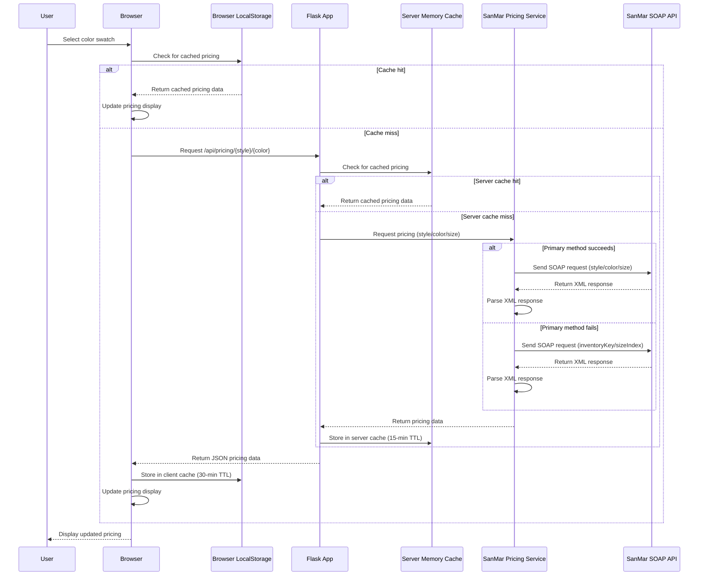

# Architecture Diagram: Dynamic Product Pricing

The following diagram illustrates the flow of data and interactions between components for the dynamic product pricing feature when a color swatch is selected.

## Component Responsibilities

### Frontend Components
- **Browser**: Handles user interactions and displays pricing data
- **LocalStorage**: Provides client-side caching for 30 minutes

### Backend Components
- **Flask App**: Exposes API endpoints and coordinates pricing requests
- **Server Memory Cache**: Provides server-side caching for 15 minutes
- **SanMar Pricing Service**: Handles SOAP requests and response parsing

### External Systems
- **SanMar SOAP API**: Provides pricing data for products

## Data Flow

1. User selects a color swatch
2. Browser checks LocalStorage for cached pricing data
3. If cached data exists and is valid, display it
4. Otherwise, make AJAX request to Flask API
5. Flask checks server-side cache for pricing data
6. If server cache hit, return cached data
7. Otherwise, request pricing from SanMar Pricing Service
8. Pricing Service makes SOAP request to SanMar API
9. Parse response and return pricing data to Flask
10. Flask stores pricing in server cache and returns to browser
11. Browser stores pricing in LocalStorage and updates display

## Error Handling

- If primary request method fails, fall back to alternate method
- If all API requests fail, use default pricing data
- Client and server caching reduces impact of API failures